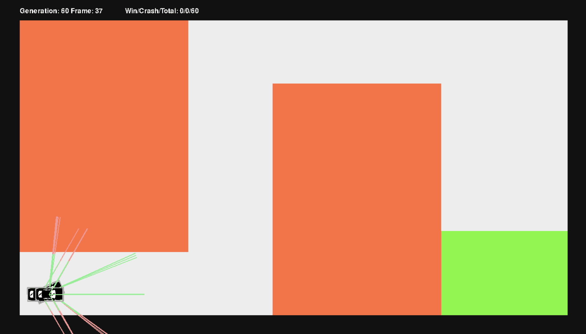

# AI_2d_racer
AI for topdown 2d driving, built on pygame.

Example generation of 60 drivers powered by 4 hidden neurons, showing distinctly faster and slower strategies:

## Credits
- [Car Image by Leremy on flaticon.com](https://www.flaticon.com/free-icons/top)